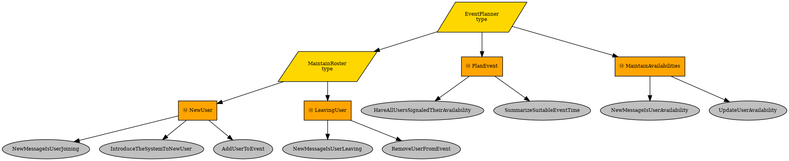

## Example: Behavior Trees for LLM Chatbots

This simple example shows how complex interaction can be coordinated between humans and an LLM chatbot to go through a complex goal-directed interaction while utilizing LLM chatbot capabilities using [Behavior Trees](https://en.wikipedia.org/wiki/Behavior_tree_%28artificial_intelligence,_robotics_and_control%29).

The demonstration case is a scheme where the bot and people are in the same chat channel or group.

The bot is set up to organize an event, which it does by finding a time suitable to everyone. The use case was selected to be meaningfully complex and easy to understand.

People can signal their intent to attend the event, to cancel their attendance, and to tell their event availabilities.
All these are normal natural language, and the system uses LLM chatbot capabilities to update the state of the consensus, and ultimately tell the users what the conclusion was.

The entities in this use case are:
- User(s)
- Channel
- Coordinator (runs the Behavior Tree)
- LLM Chatbot

The Behavior Tree is event-driven and is ticked only as things happen in the channel, or an event is emitted from a behavior.

In the above example, the root node ticks all its children in parallel (parallelograms), and each of the children represent parallel goals of the system.

The middle level rectangles are sequential nodes which tick their children from left to right until something starts processing or fails. These are structured to have a gating condition first, which if successful, allows the next child to be ticked.

The leaf level ellipse nodes are behaviors, which are either conditions or actions. Conditions often use the LLM chatbot interaction to interpret the state of things, and the actions make changes to the world state or create messages towards the users.

The coordinator is the only thing which directly interacts with the chatbot, and controls the chatbot sessions, and if necessary, relays the user messages to the chatbot and chatbot messages to the users. The state is largely maintained in the blackboard of the Behavior Tree.

Currently none of the code interfacing to the chatroom and to the LLM chatbot are implemented, but the general structure already shows how Behavior Trees can be used to structure complex interaction processes into self-documenting goal-driven Behavior Tree patterns in a modular and extensible fashion.
